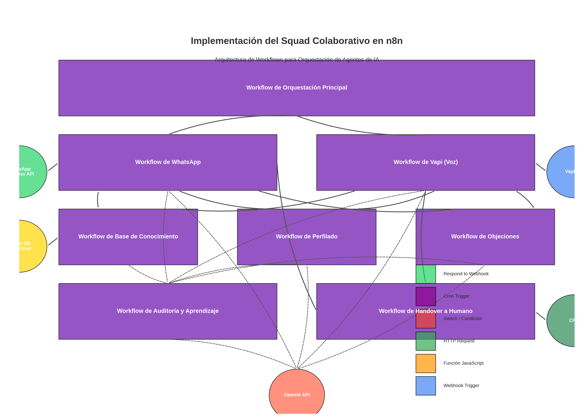

# Integración del CRM GoHighLevel (GHL) y Agente Estratégico en n8n

Este documento detalla la implementación de workflows en n8n para integrar el CRM de GoHighLevel (GHL) con el Squad Colaborativo de Agentes de IA para Selvadentro Tulum, así como la creación de un Agente Estratégico que analice datos y proponga mejoras en los embudos de ventas.

## 1. Arquitectura de la Integración GHL

La integración con GoHighLevel permitirá:

1. **Sincronización bidireccional de datos** entre el Squad Colaborativo y GHL
2. **Gestión centralizada de leads y clientes** en GHL
3. **Visualización en tiempo real** de KPIs y métricas de rendimiento
4. **Automatización de seguimientos** basados en las interacciones con los agentes de IA
5. **Creación de un dashboard personalizado** para monitoreo ejecutivo



## 2. Workflows Principales para la Integración GHL

### 2.1 Workflow de Sincronización de Contactos GHL

Este workflow sincroniza los contactos entre el Squad Colaborativo y GoHighLevel, asegurando que toda la información de leads y clientes esté actualizada en ambos sistemas.

```json
{
  "nodes": [
    {
      "parameters": {
        "rule": {
          "interval": [
            {
              "field": "minutes",
              "minutesInterval": 15
            }
          ]
        }
      },
      "name": "Cron Trigger",
      "type": "n8n-nodes-base.cron",
      "typeVersion": 1,
      "position": [
        250,
        300
      ]
    },
    {
      "parameters": {
        "url": "https://api.gohighlevel.com/v1/contacts/",
        "authentication": "genericCredentialType",
        "genericAuthType": "httpHeaderAuth",
        "options": {
          "queryParameters": {
            "parameters": [
              {
                "name": "limit",
                "value": "100"
              },
              {
                "name": "startAfter",
                "value": "={{ $json.lastSyncTimestamp || '' }}"
              }
            ]
          }
        }
      },
      "name": "HTTP Request: Obtener Contactos GHL",
      "type": "n8n-nodes-base.httpRequest",
      "typeVersion": 3,
      "position": [
        450,
        300
      ],
      "credentials": {
        "httpHeaderAuth": {
          "id": "5",
          "name": "GHL API Key"
        }
      }
    },
    {
      "parameters": {
        "functionCode": "// Procesar contactos de GHL\nconst input = items[0].json;\nconst contacts = input.contacts || [];\n\n// Formatear contactos para la base de conocimiento\nconst formattedContacts = contacts.map(contact => {\n  return {\n    id: contact.id,\n    source: \"ghl\",\n    name: `${contact.firstName || ''} ${contact.lastName || ''}`.trim(),\n    email: contact.email,\n    phone: contact.phone,\n    tags: contact.tags || [],\n    customFields: contact.customFields || {},\n    pipelineStage: contact.pipelineStage,\n    lastUpdated: contact.dateUpdated || new Date().toISOString(),\n    buyerPersona: contact.customFields?.buyerPersona || 'No asignado',\n    awarenessLevel: contact.customFields?.awarenessLevel || 'No determinado'\n  };\n});\n\n// Guardar timestamp para próxima sincronización\nconst syncTimestamp = new Date().toISOString();\n\nreturn {\n  json: {\n    contacts: formattedContacts,\n    count: formattedContacts.length,\n    syncTimestamp: syncTimestamp\n  }\n};"
      },
      "name": "Función: Procesar Contactos GHL",
      "type": "n8n-nodes-base.function",
      "typeVersion": 1,
      "position": [
        650,
        300
      ]
    },
    {
      "parameters": {
        "url": "={{$env.API_BASE_URL}}/knowledge/contacts/sync",
        "authentication": "genericCredentialType",
        "genericAuthType": "httpHeaderAuth",
        "options": {},
        "sendBody": true,
        "bodyParameters": {
          "parameters": [
            {
              "name": "contacts",
              "value": "={{$node[\"Función: Procesar Contactos GHL\"].json.contacts}}"
            },
            {
              "name": "syncTimestamp",
              "value": "={{$node[\"Función: Procesar Contactos GHL\"].json.syncTimestamp}}"
            },
            {
              "name": "source",
              "value": "ghl"
            }
          ]
        }
      },
      "name": "HTTP Request: Actualizar Base de Conocimiento",
      "type": "n8n-nodes-base.httpRequest",
      "typeVersion": 3,
      "position": [
        850,
        300
      ],
      "credentials": {
        "httpHeaderAuth": {
          "id": "4",
          "name": "API Auth"
        }
      }
    },
    {
      "parameters": {
        "url": "={{$env.API_BASE_URL}}/contacts/pending-sync",
        "authentication": "genericCredentialType",
        "genericAuthType": "httpHeaderAuth",
        "options": {}
      },
      "name": "HTTP Request: Obtener Contactos Pendientes",
      "type": "n8n-nodes-base.httpRequest",
      "typeVersion": 3,
      "position": [
        450,
        450
      ],
      "credentials": {
        "httpHeaderAuth": {
          "id": "4",
          "name": "API Auth"
        }
      }
    },
    {
      "parameters": {
        "functionCode": "// Preparar contactos para enviar a GHL\nconst input = items[0].json;\nconst pendingContacts = input.contacts || [];\n\n// Formatear para GHL API\nconst ghlContacts = pendingContacts.map(contact => {\n  return {\n    firstName: contact.name.split(' ')[0] || '',\n    lastName: contact.name.split(' ').slice(1).join(' ') || '',\n    email: contact.email,\n    phone: contact.phone,\n    tags: contact.tags || [],\n    customFields: {\n      buyerPersona: contact.buyerPersona || 'No asignado',\n      awarenessLevel: contact.awarenessLevel || 'No determinado',\n      interactionCount: contact.interactionCount || 0,\n      lastInteraction: contact.lastInteraction || ''\n    }\n  };\n});\n\nreturn {\n  json: {\n    contacts: ghlContacts,\n    count: ghlContacts.length\n  }\n};"
      },
      "name": "Función: Preparar Contactos para GHL",
      "type": "n8n-nodes-base.function",
      "typeVersion": 1,
      "position": [
        650,
        450
      ]
    },
    {
      "parameters": {
        "batchSize": 10,
        "options": {}
      },
      "name": "Split In Batches",
      "type": "n8n-nodes-base.splitInBatches",
      "typeVersion": 2,
      "position": [
        850,
        450
      ]
    },
    {
      "parameters": {
        "url": "https://api.gohighlevel.com/v1/contacts/",
        "authentication": "genericCredentialType",
        "genericAuthType": "httpHeaderAuth",
        "options": {},
        "sendBody": true,
        "bodyParameters": {
          "parameters": [
            {
              "name": "contact",
              "value": "={{$json}}"
            }
          ]
        }
      },
      "name": "HTTP Request: Crear/Actualizar Contacto GHL",
      "type": "n8n-nodes-base.httpRequest",
      "typeVersion": 3,
      "position": [
        1050,
        450
      ],
      "credentials": {
        "httpHeaderAuth": {
          "id": "5",
          "name": "GHL API Key"
        }
      }
    }
  ],
  "connections": {
    "Cron Trigger": {
      "main": [
        [
          {
            "node": "HTTP Request: Obtener Contactos GHL",
            "type": "main",
            "index": 0
          },
          {
            "node": "HTTP Request: Obtener Contactos Pendientes",
            "type": "main",
            "index": 0
          }
        ]
      ]
    },
    "HTTP Request: Obtener Contactos GHL": {
      "main": [
        [
          {
            "node": "Función: Procesar Contactos GHL",
            "type": "main",
            "index": 0
          }
        ]
      ]
    },
    "Función: Procesar Contactos GHL": {
      "main": [
        [
          {
            "node": "HTTP Request: Actualizar Base de Conocimiento",
            "type": "main",
            "index": 0
          }
        ]
      ]
    },
    "HTTP Request: Obtener Contactos Pendientes": {
      "main": [
        [
          {
            "node": "Función: Preparar Contactos para GHL",
            "type": "main",
            "index": 0
          }
        ]
      ]
    },
    "Función: Preparar Contactos para GHL": {
      "main": [
        [
          {
            "node": "Split In Batches",
            "type": "main",
            "index": 0
          }
        ]
      ]
    },
    "Split In Batches": {
      "main": [
        [
          {
            "node": "HTTP Request: Crear/Actualizar Contacto GHL",
            "type": "main",
            "index": 0
          }
        ]
      ]
    }
  }
}
```

### 2.2 Workflow de Actualización de Pipeline GHL

Este workflow actualiza el estado de los leads en el pipeline de GHL basado en las interacciones con los agentes de IA.

```json
{
  "nodes": [
    {
      "parameters": {
        "httpMethod": "POST",
        "path": "ghl/pipeline/update",
        "options": {
          "rawBody": true
        },
        "authentication": "headerAuth",
        "responseMode": "responseNode",
        "responseData": "allEntries"
      },
      "name": "Webhook Trigger",
      "type": "n8n-nodes-base.webhook",
      "typeVersion": 1,
      "position": [
        250,
        300
      ]
    },
    {
      "parameters": {
        "functionCode": "// Extraer información de la interacción\nconst input = items[0].json;\nconst contactId = input.contactId;\nconst interactionType = input.interactionType;\nconst interactionResult = input.interactionResult;\nconst pipelineId = input.pipelineId || '{{$env.GHL_DEFAULT_PIPELINE_ID}}';\n\n// Determinar la etapa del pipeline basado en la interacción\nlet stageId = '';\nlet stageAction = 'move';\n\nswitch(interactionResult) {\n  case 'qualified_lead':\n    stageId = '{{$env.GHL_QUALIFIED_LEAD_STAGE_ID}}';\n    break;\n  case 'appointment_scheduled':\n    stageId = '{{$env.GHL_APPOINTMENT_STAGE_ID}}';\n    break;\n  case 'objection_handled':\n    stageId = '{{$env.GHL_OBJECTION_HANDLED_STAGE_ID}}';\n    break;\n  case 'handover_to_human':\n    stageId = '{{$env.GHL_HANDOVER_STAGE_ID}}';\n    break;\n  default:\n    stageId = '{{$env.GHL_NEW_LEAD_STAGE_ID}}';\n}\n\nreturn {\n  json: {\n    contactId: contactId,\n    pipelineId: pipelineId,\n    stageId: stageId,\n    stageAction: stageAction,\n    interactionType: interactionType,\n    interactionResult: interactionResult,\n    timestamp: new Date().toISOString()\n  }\n};"
      },
      "name": "Función: Determinar Etapa Pipeline",
      "type": "n8n-nodes-base.function",
      "typeVersion": 1,
      "position": [
        450,
        300
      ]
    },
    {
      "parameters": {
        "url": "=https://api.gohighlevel.com/v1/pipelines/{{$node[\"Función: Determinar Etapa Pipeline\"].json.pipelineId}}/opportunities/",
        "authentication": "genericCredentialType",
        "genericAuthType": "httpHeaderAuth",
        "options": {},
        "sendBody": true,
        "bodyParameters": {
          "parameters": [
            {
              "name": "contactId",
              "value": "={{$node[\"Función: Determinar Etapa Pipeline\"].json.contactId}}"
            },
            {
              "name": "stageId",
              "value": "={{$node[\"Función: Determinar Etapa Pipeline\"].json.stageId}}"
            },
            {
              "name": "title",
              "value": "=Lead de Selvadentro - {{$node[\"Función: Determinar Etapa Pipeline\"].json.interactionResult}}"
            },
            {
              "name": "status",
              "value": "open"
            },
            {
              "name": "monetaryValue",
              "value": "500000"
            }
          ]
        }
      },
      "name": "HTTP Request: Actualizar Pipeline GHL",
      "type": "n8n-nodes-base.httpRequest",
      "typeVersion": 3,
      "position": [
        650,
        300
      ],
      "credentials": {
        "httpHeaderAuth": {
          "id": "5",
          "name": "GHL API Key"
        }
      }
    },
    {
      "parameters": {
        "url": "=https://api.gohighlevel.com/v1/contacts/{{$node[\"Función: Determinar Etapa Pipeline\"].json.contactId}}/notes",
        "authentication": "genericCredentialType",
        "genericAuthType": "httpHeaderAuth",
        "options": {},
        "sendBody": true,
        "bodyParameters": {
          "parameters": [
            {
              "name": "title",
              "value": "=Interacción IA: {{$node[\"Función: Determinar Etapa Pipeline\"].json.interactionType}}"
            },
            {
              "name": "body",
              "value": "=Resultado: {{$node[\"Función: Determinar Etapa Pipeline\"].json.interactionResult}}\nFecha: {{$node[\"Función: Determinar Etapa Pipeline\"].json.timestamp}}\n\nEl contacto ha sido movido a la etapa correspondiente en el pipeline."
            }
          ]
        }
      },
      "name": "HTTP Request: Añadir Nota GHL",
      "type": "n8n-nodes-base.httpRequest",
      "typeVersion": 3,
      "position": [
        850,
        300
      ],
      "credentials": {
        "httpHeaderAuth": {
          "id": "5",
          "name": "GHL API Key"
        }
      }
    },
    {
      "parameters": {
        "respondWithData": true,
        "responseData": {
          "response": {
            "status": "success",
            "message": "Pipeline updated successfully",
            "contactId": "={{$node[\"Función: Determinar Etapa Pipeline\"].json.contactId}}",
            "pipelineId": "={{$node[\"Función: Determinar Etapa Pipeline\"].json.pipelineId}}",
            "stageId": "={{$node[\"Función: Determinar Etapa Pipeline\"].json.stageId}}"
          }
        },
        "options": {}
      },
      "name": "Respond to Webhook",
      "type": "n8n-nodes-base.respondToWebhook",
      "typeVersion": 1,
      "position": [
        1050,
        300
      ]
    }
  ],
  "connections": {
    "Webhook Trigger": {
      "main": [
        [
          {
            "node": "Función: Determinar Etapa Pipeline",
            "type": "main",
            "index": 0
          }
        ]
      ]
    },
    "Función: Determinar Etapa Pipeline": {
      "main": [
        [
          {
            "node": "HTTP Request: Actualizar Pipeline GHL",
            "type": "main",
            "index": 0
          }
        ]
      ]
    },
    "HTTP Request: Actualizar Pipeline GHL": {
      "main": [
        [
          {
            "node": "HTTP Request: Añadir Nota GHL",
            "type": "main",
            "index": 0
          }
        ]
      ]
    },
    "HTTP Request: Añadir Nota GHL": {
      "main": [
        [
          {
            "node": "Respond to Webhook",
            "type": "main",
            "index": 0
          }
        ]
      ]
    }
  }
}
```

### 2.3 Workflow de Sincronización de Tareas y Seguimientos

Este workflow sincroniza las tareas y seguimientos entre el Squad Colaborativo y GHL.

```json
{
  "nodes": [
    {
      "parameters": {
        "httpMethod": "POST",
        "path": "ghl/task/create",
        "options": {
          "rawBody": true
        },
        "authentication": "headerAuth",
        "responseMode": "responseNode",
        "responseData": "allEntries"
      },
      "name": "Webhook Trigger",
      "type": "n8n-nodes-base.webhook",
      "typeVersion": 1,
      "position": [
        250,
        300
      ]
    },
    {
      "parameters": {
        "functionCode": "// Procesar datos de la tarea\nconst input = items[0].json;\nconst contactId = input.contactId;\nconst taskType = input.taskType || 'follow_up';\nconst taskTitle = input.taskTitle || 'Seguimiento automático';\nconst taskDescription = input.taskDescription || 'Seguimiento generado por el Agente de IA';\nconst dueDate = input.dueDate || new Date(Date.now() + 24 * 3600 * 1000).toISOString();\nconst assignedTo = input.assignedTo || '{{$env.GHL_DEFAULT_USER_ID}}';\n\n// Formatear fecha para GHL\nconst formattedDueDate = dueDate.split('T')[0];\n\nreturn {\n  json: {\n    contactId: contactId,\n    taskType: taskType,\n    taskTitle: taskTitle,\n    taskDescription: taskDescription,\n    dueDate: formattedDueDate,\n    assignedTo: assignedTo\n  }\n};"
      },
      "name": "Función: Preparar Tarea",
      "type": "n8n-nodes-base.function",
      "typeVersion": 1,
      "position": [
        450,
        300
      ]
    },
    {
      "parameters": {
        "url": "https://api.gohighlevel.com/v1/tasks/",
        "authentication": "genericCredentialType",
        "genericAuthType": "httpHeaderAuth",
        "options": {},
        "sendBody": true,
        "bodyParameters": {
          "parameters": [
            {
              "name": "contactId",
              "value": "={{$node[\"Función: Preparar Tarea\"].json.contactId}}"
            },
            {
              "name": "title",
              "value": "={{$node[\"Función: Preparar Tarea\"].json.taskTitle}}"
            },
            {
              "name": "description",
              "value": "={{$node[\"Función: Preparar Tarea\"].json.taskDescription}}"
            },
            {
              "name": "dueDate",
              "value": "={{$node[\"Función: Preparar Tarea\"].json.dueDate}}"
            },
            {
              "name": "assignedTo",
              "value": "={{$node[\"Función: Preparar Tarea\"].json.assignedTo}}"
            }
          ]
        }
      },
      "name": "HTTP Request: Crear Tarea GHL",
      "type": "n8n-nodes-base.httpRequest",
      "typeVersion": 3,
      "position": [
        650,
        300
      ],
      "credentials": {
        "httpHeaderAuth": {
          "id": "5",
          "name": "GHL API Key"
        }
      }
    },
    {
      "parameters": {
        "respondWithData": true,
        "responseData": {
          "response": {
            "status": "success",
            "message": "Task created successfully",
            "taskId": "={{$node[\"HTTP Request: Crear Tarea GHL\"].json.id}}",
            "contactId": "={{$node[\"Función: Preparar Tarea\"].json.contactId}}"
          }
        },
        "options": {}
      },
      "name": "Respond to Webhook",
      "type": "n8n-nodes-base.respondToWebhook",
      "typeVersion": 1,
      "position": [
        850,
        300
      ]
    }
  ],
  "connections": {
    "Webhook Trigger": {
      "main": [
        [
          {
            "node": "Función: Preparar Tarea",
            "type": "main",
            "index": 0
          }
        ]
      ]
    },
    "Función: Preparar Tarea": {
      "main": [
        [
          {
            "node": "HTTP Request: Crear Tarea GHL",
            "type": "main",
            "index": 0
          }
        ]
      ]
    },
    "HTTP Request: Crear Tarea GHL": {
      "main": [
        [
          {
            "node": "Respond to Webhook",
            "type": "main",
            "index": 0
          }
        ]
      ]
    }
  }
}
```

## 3. Agente Estratégico para Análisis y Optimización

El Agente Estratégico es un componente clave que analiza los datos de interacciones, KPIs y comportamiento de los leads para proponer mejoras en los embudos de ventas y estrategias de conversión.

### 3.1 Workflow del Agente Estratégico

```json
{
  "nodes": [
    {
      "parameters": {
        "rule": {
          "interval": [
            {
              "field": "days",
              "day": 1
            }
          ]
        }
      },
      "name": "Cron Trigger",
      "type": "n8n-nodes-base.cron",
      "typeVersion": 1,
      "position": [
        250,
        300
      ]
    },
    {
      "parameters": {
        "url": "={{$env.API_BASE_URL}}/analytics/interactions",
        "authentication": "genericCredentialType",
        "genericAuthType": "httpHeaderAuth",
        "options": {
          "queryParameters": {
            "parameters": [
              {
                "name": "days",
                "value": "30"
              }
            ]
          }
        }
      },
      "name": "HTTP Request: Obtener Datos Interacciones",
      "type": "n8n-nodes-base.httpRequest",
      "typeVersion": 3,
      "position": [
        450,
        200
      ],
      "credentials": {
        "httpHeaderAuth": {
          "id": "4",
          "name": "API Auth"
        }
      }
    },
    {
      "parameters": {
        "url": "https://api.gohighlevel.com/v1/pipelines/stats",
        "authentication": "genericCredentialType",
        "genericAuthType": "httpHeaderAuth",
        "options": {
          "queryParameters": {
            "parameters": [
              {
                "name": "pipelineId",
                "value": "={{$env.GHL_DEFAULT_PIPELINE_ID}}"
              },
              {
                "name": "dateStart",
                "value": "={{$formatDate($now.minus({ days: 30 }), \"YYYY-MM-DD\")}}"
              },
              {
                "name": "dateEnd",
                "value": "={{$formatDate($now, \"YYYY-MM-DD\")}}"
              }
            ]
          }
        }
      },
      "name": "HTTP Request: Obtener Datos Pipeline GHL",
      "type": "n8n-nodes-base.httpRequest",
      "typeVersion": 3,
      "position": [
        450,
        350
      ],
      "credentials": {
        "httpHeaderAuth": {
          "id": "5",
          "name": "GHL API Key"
        }
      }
    },
    {
      "parameters": {
        "url": "={{$env.API_BASE_URL}}/analytics/kpis",
        "authentication": "genericCredentialType",
        "genericAuthType": "httpHeaderAuth",
        "options": {
          "queryParameters": {
            "parameters": [
              {
                "name": "days",
                "value": "30"
              }
            ]
          }
        }
      },
      "name": "HTTP Request: Obtener KPIs",
      "type": "n8n-nodes-base.httpRequest",
      "typeVersion": 3,
      "position": [
        450,
        500
      ],
      "credentials": {
        "httpHeaderAuth": {
          "id": "4",
          "name": "API Auth"
        }
      }
    },
    {
      "parameters": {
        "functionCode": "// Combinar todos los datos para análisis\nconst interactionsData = $node[\"HTTP Request: Obtener Datos Interacciones\"].json;\nconst pipelineData = $node[\"HTTP Request: Obtener Datos Pipeline GHL\"].json;\nconst kpisData = $node[\"HTTP Request: Obtener KPIs\"].json;\n\n// Preparar datos consolidados para análisis\nconst analysisData = {\n  interactions: interactionsData,\n  pipeline: pipelineData,\n  kpis: kpisData,\n  period: {\n    start: $formatDate($now.minus({ days: 30 }), \"YYYY-MM-DD\"),\n    end: $formatDate($now, \"YYYY-MM-DD\")\n  }\n};\n\nreturn {\n  json: analysisData\n};"
      },
      "name": "Función: Preparar Datos para Análisis",
      "type": "n8n-nodes-base.function",
      "typeVersion": 1,
      "position": [
        650,
        300
      ]
    },
    {
      "parameters": {
        "url": "https://api.openai.com/v1/chat/completions",
        "authentication": "genericCredentialType",
        "genericAuthType": "httpHeaderAuth",
        "options": {},
        "sendBody": true,
        "bodyParameters": {
          "parameters": [
            {
              "name": "model",
              "value": "gpt-4"
            },
            {
              "name": "messages",
              "value": "=[\n  {\n    \"role\": \"system\",\n    \"content\": \"Eres un Agente Estratégico experto en análisis de datos de ventas inmobiliarias de lujo y optimización de embudos de conversión. Tu tarea es analizar datos de interacciones, KPIs y comportamiento de leads para proponer mejoras estratégicas en los embudos de ventas y estrategias de conversión para Selvadentro Tulum, un desarrollo inmobiliario de lujo que ofrece lotes selváticos con cenotes privados. Tus recomendaciones deben ser específicas, accionables y basadas en datos.\"\n  },\n  {\n    \"role\": \"user\",\n    \"content\": \"Analiza los siguientes datos de los últimos 30 días y proporciona recomendaciones estratégicas para optimizar nuestros embudos de ventas y mejorar las tasas de conversión. Identifica cuellos de botella, oportunidades de mejora y propón cambios específicos en nuestras estrategias.\\n\\nDatos de Interacciones:\\n{{$node[\"Función: Preparar Datos para Análisis\"].json.interactions | stringify}}\\n\\nDatos de Pipeline:\\n{{$node[\"Función: Preparar Datos para Análisis\"].json.pipeline | stringify}}\\n\\nKPIs:\\n{{$node[\"Función: Preparar Datos para Análisis\"].json.kpis | stringify}}\\n\\nPeriodo de Análisis: {{$node[\"Función: Preparar Datos para Análisis\"].json.period.start}} a {{$node[\"Función: Preparar Datos para Análisis\"].json.period.end}}\"\n  }\n]"
            },
            {
              "name": "temperature",
              "value": 0.2
            },
            {
              "name": "max_tokens",
              "value": 2500
            }
          ]
        }
      },
      "name": "HTTP Request: OpenAI Análisis Estratégico",
      "type": "n8n-nodes-base.httpRequest",
      "typeVersion": 3,
      "position": [
        850,
        300
      ],
      "credentials": {
        "httpHeaderAuth": {
          "id": "1",
          "name": "OpenAI API Key"
        }
      }
    },
    {
      "parameters": {
        "functionCode": "// Extraer y estructurar las recomendaciones estratégicas\nconst input = items[0].json;\nconst analysis = input.choices[0].message.content;\n\n// Extraer secciones principales usando expresiones regulares\nconst findSection = (text, sectionName) => {\n  const regex = new RegExp(`${sectionName}[:\\s]+(.*?)(?=\\n\\s*\\n\\s*[A-Z]|$)`, 's');\n  const match = text.match(regex);\n  return match ? match[1].trim() : '';\n};\n\n// Extraer recomendaciones específicas\nconst extractRecommendations = (text) => {\n  const recommendations = [];\n  const regex = /\\d+\\.\\s+([^\\n]+)/g;\n  let match;\n  \n  while ((match = regex.exec(text)) !== null) {\n    recommendations.push(match[1].trim());\n  }\n  \n  return recommendations;\n};\n\n// Estructurar el análisis\nconst structuredAnalysis = {\n  summary: findSection(analysis, 'Resumen Ejecutivo'),\n  bottlenecks: findSection(analysis, 'Cuellos de Botella Identificados'),\n  opportunities: findSection(analysis, 'Oportunidades de Mejora'),\n  recommendations: {\n    pipeline: extractRecommendations(findSection(analysis, 'Recomendaciones para el Embudo de Ventas')),\n    messaging: extractRecommendations(findSection(analysis, 'Recomendaciones para Mensajes y Comunicación')),\n    followup: extractRecommendations(findSection(analysis, 'Recomendaciones para Seguimiento')),\n    agentTraining: extractRecommendations(findSection(analysis, 'Recomendaciones para Entrenamiento de Agentes'))\n  },\n  implementationPlan: findSection(analysis, 'Plan de Implementación Sugerido'),\n  kpiTargets: findSection(analysis, 'Objetivos de KPI Recomendados'),\n  rawAnalysis: analysis\n};\n\nreturn {\n  json: {\n    date: $formatDate($now, \"YYYY-MM-DD\"),\n    period: $node[\"Función: Preparar Datos para Análisis\"].json.period,\n    analysis: structuredAnalysis\n  }\n};"
      },
      "name": "Función: Estructurar Análisis",
      "type": "n8n-nodes-base.function",
      "typeVersion": 1,
      "position": [
        1050,
        300
      ]
    },
    {
      "parameters": {
        "url": "={{$env.API_BASE_URL}}/strategy/recommendations",
        "authentication": "genericCredentialType",
        "genericAuthType": "httpHeaderAuth",
        "options": {},
        "sendBody": true,
        "bodyParameters": {
          "parameters": [
            {
              "name": "date",
              "value": "={{$node[\"Función: Estructurar Análisis\"].json.date}}"
            },
            {
              "name": "period",
              "value": "={{$node[\"Función: Estructurar Análisis\"].json.period}}"
            },
            {
              "name": "analysis",
              "value": "={{$node[\"Función: Estructurar Análisis\"].json.analysis}}"
            }
          ]
        }
      },
      "name": "HTTP Request: Guardar Recomendaciones",
      "type": "n8n-nodes-base.httpRequest",
      "typeVersion": 3,
      "position": [
        1250,
        300
      ],
      "credentials": {
        "httpHeaderAuth": {
          "id": "4",
          "name": "API Auth"
        }
      }
    },
    {
      "parameters": {
        "url": "https://api.gohighlevel.com/v1/custom-values/",
        "authentication": "genericCredentialType",
        "genericAuthType": "httpHeaderAuth",
        "options": {},
        "sendBody": true,
        "bodyParameters": {
          "parameters": [
            {
              "name": "name",
              "value": "=Recomendaciones Estratégicas - {{$node[\"Función: Estructurar Análisis\"].json.date}}"
            },
            {
              "name": "value",
              "value": "={{$node[\"Función: Estructurar Análisis\"].json.analysis.summary}}\n\nPrincipales Recomendaciones:\n{{$node[\"Función: Estructurar Análisis\"].json.analysis.recommendations.pipeline.slice(0, 3).join('\\n')}}"
            },
            {
              "name": "type",
              "value": "text"
            }
          ]
        }
      },
      "name": "HTTP Request: Crear Valor Personalizado GHL",
      "type": "n8n-nodes-base.httpRequest",
      "typeVersion": 3,
      "position": [
        1250,
        450
      ],
      "credentials": {
        "httpHeaderAuth": {
          "id": "5",
          "name": "GHL API Key"
        }
      }
    },
    {
      "parameters": {
        "url": "={{$env.API_BASE_URL}}/notifications/team",
        "authentication": "genericCredentialType",
        "genericAuthType": "httpHeaderAuth",
        "options": {},
        "sendBody": true,
        "bodyParameters": {
          "parameters": [
            {
              "name": "type",
              "value": "strategy_report"
            },
            {
              "name": "title",
              "value": "=Reporte Estratégico - {{$node[\"Función: Estructurar Análisis\"].json.date}}"
            },
            {
              "name": "content",
              "value": "=El Agente Estratégico ha generado nuevas recomendaciones para optimizar los embudos de ventas y estrategias de conversión.\n\nResumen Ejecutivo:\n{{$node[\"Función: Estructurar Análisis\"].json.analysis.summary}}\n\nConsulte el reporte completo en el dashboard de GHL."
            },
            {
              "name": "priority",
              "value": "high"
            },
            {
              "name": "recipients",
              "value": "[\"sales_manager\", \"marketing_team\", \"executive_team\"]"
            }
          ]
        }
      },
      "name": "HTTP Request: Notificar Equipo",
      "type": "n8n-nodes-base.httpRequest",
      "typeVersion": 3,
      "position": [
        1450,
        300
      ],
      "credentials": {
        "httpHeaderAuth": {
          "id": "4",
          "name": "API Auth"
        }
      }
    }
  ],
  "connections": {
    "Cron Trigger": {
      "main": [
        [
          {
            "node": "HTTP Request: Obtener Datos Interacciones",
            "type": "main",
            "index": 0
          },
          {
            "node": "HTTP Request: Obtener Datos Pipeline GHL",
            "type": "main",
            "index": 0
          },
          {
            "node": "HTTP Request: Obtener KPIs",
            "type": "main",
            "index": 0
          }
        ]
      ]
    },
    "HTTP Request: Obtener Datos Interacciones": {
      "main": [
        [
          {
            "node": "Función: Preparar Datos para Análisis",
            "type": "main",
            "index": 0
          }
        ]
      ]
    },
    "HTTP Request: Obtener Datos Pipeline GHL": {
      "main": [
        [
          {
            "node": "Función: Preparar Datos para Análisis",
            "type": "main",
            "index": 0
          }
        ]
      ]
    },
    "HTTP Request: Obtener KPIs": {
      "main": [
        [
          {
            "node": "Función: Preparar Datos para Análisis",
            "type": "main",
            "index": 0
          }
        ]
      ]
    },
    "Función: Preparar Datos para Análisis": {
      "main": [
        [
          {
            "node": "HTTP Request: OpenAI Análisis Estratégico",
            "type": "main",
            "index": 0
          }
        ]
      ]
    },
    "HTTP Request: OpenAI Análisis Estratégico": {
      "main": [
        [
          {
            "node": "Función: Estructurar Análisis",
            "type": "main",
            "index": 0
          }
        ]
      ]
    },
    "Función: Estructurar Análisis": {
      "main": [
        [
          {
            "node": "HTTP Request: Guardar Recomendaciones",
            "type": "main",
            "index": 0
          },
          {
            "node": "HTTP Request: Crear Valor Personalizado GHL",
            "type": "main",
            "index": 0
          }
        ]
      ]
    },
    "HTTP Request: Guardar Recomendaciones": {
      "main": [
        [
          {
            "node": "HTTP Request: Notificar Equipo",
            "type": "main",
            "index": 0
          }
        ]
      ]
    }
  }
}
```

## 4. Dashboard Personalizado en GHL

### 4.1 Configuración del Dashboard en GHL

GoHighLevel permite la creación de dashboards personalizados que pueden servir como panel de control para monitorear el rendimiento del Squad Colaborativo de Agentes de IA. A continuación, se detallan los pasos para configurar un dashboard efectivo:

1. **Acceder a la sección de Dashboards en GHL**:
   - Iniciar sesión en la cuenta de GoHighLevel
   - Navegar a "Dashboards" en el menú principal
   - Hacer clic en "Create New Dashboard"

2. **Configurar widgets clave para el dashboard**:
   - **Widget de Pipeline**: Muestra el estado actual del embudo de ventas con todas las etapas
   - **Widget de Conversiones**: Visualiza las tasas de conversión entre etapas
   - **Widget de Actividad de Agentes**: Muestra las interacciones recientes de los agentes de IA
   - **Widget de KPIs**: Presenta métricas clave como leads generados, citas agendadas, etc.
   - **Widget de Recomendaciones Estratégicas**: Muestra las últimas recomendaciones del Agente Estratégico

3. **Configurar acceso y permisos**:
   - Asignar permisos de visualización a los miembros del equipo según su rol
   - Configurar notificaciones automáticas para cambios importantes

### 4.2 Workflow para Actualizar el Dashboard

```json
{
  "nodes": [
    {
      "parameters": {
        "rule": {
          "interval": [
            {
              "field": "hours",
              "hour": 1
            }
          ]
        }
      },
      "name": "Cron Trigger",
      "type": "n8n-nodes-base.cron",
      "typeVersion": 1,
      "position": [
        250,
        300
      ]
    },
    {
      "parameters": {
        "url": "={{$env.API_BASE_URL}}/analytics/dashboard",
        "authentication": "genericCredentialType",
        "genericAuthType": "httpHeaderAuth",
        "options": {}
      },
      "name": "HTTP Request: Obtener Datos Dashboard",
      "type": "n8n-nodes-base.httpRequest",
      "typeVersion": 3,
      "position": [
        450,
        300
      ],
      "credentials": {
        "httpHeaderAuth": {
          "id": "4",
          "name": "API Auth"
        }
      }
    },
    {
      "parameters": {
        "functionCode": "// Preparar datos para actualizar el dashboard de GHL\nconst input = items[0].json;\n\n// Extraer métricas clave\nconst metrics = input.metrics || {};\nconst interactions = input.interactions || {};\nconst conversions = input.conversions || {};\n\n// Formatear para GHL dashboard\nconst dashboardData = {\n  kpis: [\n    {\n      name: \"Leads Generados (30 días)\",\n      value: metrics.leadsGenerated || 0,\n      change: metrics.leadsGeneratedChange || 0,\n      type: \"number\"\n    },\n    {\n      name: \"Tasa de Cualificación\",\n      value: `${metrics.qualificationRate || 0}%`,\n      change: metrics.qualificationRateChange || 0,\n      type: \"percentage\"\n    },\n    {\n      name: \"Citas Agendadas\",\n      value: metrics.appointmentsScheduled || 0,\n      change: metrics.appointmentsScheduledChange || 0,\n      type: \"number\"\n    },\n    {\n      name: \"Tasa de Conversión a Cita\",\n      value: `${metrics.appointmentConversionRate || 0}%`,\n      change: metrics.appointmentConversionRateChange || 0,\n      type: \"percentage\"\n    },\n    {\n      name: \"Handovers a Equipo Humano\",\n      value: metrics.handoversToHuman || 0,\n      change: metrics.handoversToHumanChange || 0,\n      type: \"number\"\n    }\n  ],\n  interactionStats: {\n    whatsapp: interactions.whatsapp || 0,\n    voice: interactions.voice || 0,\n    total: interactions.total || 0,\n    avgResponseTime: interactions.avgResponseTime || \"0s\"\n  },\n  conversionRates: {\n    leadToQualified: conversions.leadToQualified || 0,\n    qualifiedToAppointment: conversions.qualifiedToAppointment || 0,\n    appointmentToHandover: conversions.appointmentToHandover || 0,\n    handoverToSale: conversions.handoverToSale || 0\n  }\n};\n\nreturn {\n  json: dashboardData\n};"
      },
      "name": "Función: Preparar Datos Dashboard",
      "type": "n8n-nodes-base.function",
      "typeVersion": 1,
      "position": [
        650,
        300
      ]
    },
    {
      "parameters": {
        "url": "https://api.gohighlevel.com/v1/custom-values/",
        "authentication": "genericCredentialType",
        "genericAuthType": "httpHeaderAuth",
        "options": {},
        "sendBody": true,
        "bodyParameters": {
          "parameters": [
            {
              "name": "name",
              "value": "=Dashboard Selvadentro - {{$formatDate($now, \"YYYY-MM-DD HH:mm\")}}"
            },
            {
              "name": "value",
              "value": "={{$node[\"Función: Preparar Datos Dashboard\"].json | stringify}}"
            },
            {
              "name": "type",
              "value": "json"
            }
          ]
        }
      },
      "name": "HTTP Request: Actualizar Dashboard GHL",
      "type": "n8n-nodes-base.httpRequest",
      "typeVersion": 3,
      "position": [
        850,
        300
      ],
      "credentials": {
        "httpHeaderAuth": {
          "id": "5",
          "name": "GHL API Key"
        }
      }
    }
  ],
  "connections": {
    "Cron Trigger": {
      "main": [
        [
          {
            "node": "HTTP Request: Obtener Datos Dashboard",
            "type": "main",
            "index": 0
          }
        ]
      ]
    },
    "HTTP Request: Obtener Datos Dashboard": {
      "main": [
        [
          {
            "node": "Función: Preparar Datos Dashboard",
            "type": "main",
            "index": 0
          }
        ]
      ]
    },
    "Función: Preparar Datos Dashboard": {
      "main": [
        [
          {
            "node": "HTTP Request: Actualizar Dashboard GHL",
            "type": "main",
            "index": 0
          }
        ]
      ]
    }
  }
}
```

## 5. Integración Completa: Diagrama de Flujo

La integración completa entre el Squad Colaborativo de Agentes de IA, GoHighLevel y el Agente Estratégico se puede visualizar en el siguiente diagrama:

```
+---------------------------+       +---------------------------+       +---------------------------+
|                           |       |                           |       |                           |
|  Squad Colaborativo de    |<----->|  Workflows de n8n para    |<----->|  GoHighLevel CRM         |
|  Agentes de IA            |       |  Integración              |       |  (Dashboard y Gestión)   |
|                           |       |                           |       |                           |
+---------------------------+       +---------------------------+       +---------------------------+
            ^                                    ^                                    ^
            |                                    |                                    |
            v                                    v                                    v
+---------------------------+       +---------------------------+       +---------------------------+
|                           |       |                           |       |                           |
|  Base de Conocimiento     |<----->|  Agente Estratégico       |------>|  Recomendaciones de      |
|  Centralizada             |       |  (Análisis y Optimización)|       |  Mejora de Embudos       |
|                           |       |                           |       |                           |
+---------------------------+       +---------------------------+       +---------------------------+
```

## 6. Variables de Entorno Necesarias

Para que estos workflows funcionen correctamente, necesitarás configurar las siguientes variables de entorno en tu instancia de n8n:

```
# Variables de API
OPENAI_API_KEY=sk-...
API_BASE_URL=http://localhost:5000/api

# Variables de GoHighLevel
GHL_API_KEY=...
GHL_DEFAULT_PIPELINE_ID=...
GHL_QUALIFIED_LEAD_STAGE_ID=...
GHL_APPOINTMENT_STAGE_ID=...
GHL_OBJECTION_HANDLED_STAGE_ID=...
GHL_HANDOVER_STAGE_ID=...
GHL_NEW_LEAD_STAGE_ID=...
GHL_DEFAULT_USER_ID=...
```

## 7. Beneficios de la Integración GHL y el Agente Estratégico

### 7.1 Beneficios para la Gestión de Ventas

1. **Visibilidad Completa**: Dashboard en tiempo real que muestra el estado de todos los leads y su progreso en el embudo de ventas
2. **Automatización de Seguimientos**: Creación automática de tareas y seguimientos basados en las interacciones con los agentes de IA
3. **Gestión Centralizada**: Todos los datos de clientes, interacciones y oportunidades en un solo lugar
4. **Trazabilidad**: Registro completo de todas las interacciones con los agentes de IA y el equipo humano

### 7.2 Beneficios del Agente Estratégico

1. **Optimización Continua**: Análisis constante de datos para identificar oportunidades de mejora
2. **Recomendaciones Basadas en Datos**: Sugerencias específicas para mejorar los embudos de ventas
3. **Detección de Patrones**: Identificación de patrones de comportamiento de los leads que pueden ser aprovechados
4. **Mejora de Mensajes**: Recomendaciones para optimizar la comunicación con diferentes perfiles de clientes
5. **Predicción de Tendencias**: Anticipación de cambios en el mercado y comportamiento de los clientes

## 8. Implementación y Despliegue

Para implementar esta integración completa, sigue estos pasos:

1. **Configuración de GoHighLevel**:
   - Crear una cuenta en GoHighLevel (si no se tiene)
   - Configurar pipelines, etapas y campos personalizados
   - Obtener API keys necesarias

2. **Configuración de n8n**:
   - Instalar n8n siguiendo las [instrucciones oficiales](https://docs.n8n.io/hosting/)
   - Configurar las variables de entorno necesarias
   - Importar los workflows proporcionados

3. **Integración con el Squad Colaborativo**:
   - Modificar los agentes existentes para que utilicen los endpoints de los workflows de n8n
   - Configurar el Agente Estratégico para que reciba datos de todas las fuentes

4. **Pruebas y Ajustes**:
   - Realizar pruebas exhaustivas de cada workflow
   - Ajustar los prompts y parámetros según sea necesario
   - Verificar la sincronización bidireccional de datos

5. **Capacitación del Equipo**:
   - Capacitar al equipo de ventas en el uso del dashboard de GHL
   - Explicar cómo interpretar las recomendaciones del Agente Estratégico
   - Establecer protocolos para la implementación de mejoras sugeridas

## Conclusión

La integración del CRM GoHighLevel con el Squad Colaborativo de Agentes de IA, junto con la implementación del Agente Estratégico, proporciona una solución completa para la gestión de ventas de Selvadentro Tulum. Esta integración no solo automatiza procesos y mejora la eficiencia operativa, sino que también proporciona inteligencia estratégica para optimizar continuamente los embudos de ventas y las estrategias de conversión.

El dashboard en GHL se convierte en un verdadero panel de control donde el cliente puede ver todo su negocio en tiempo real, mientras que el Agente Estratégico trabaja constantemente en segundo plano para analizar datos, identificar oportunidades y proponer mejoras. Esta combinación de automatización, inteligencia y visualización representa una ventaja competitiva significativa en el mercado inmobiliario de lujo.